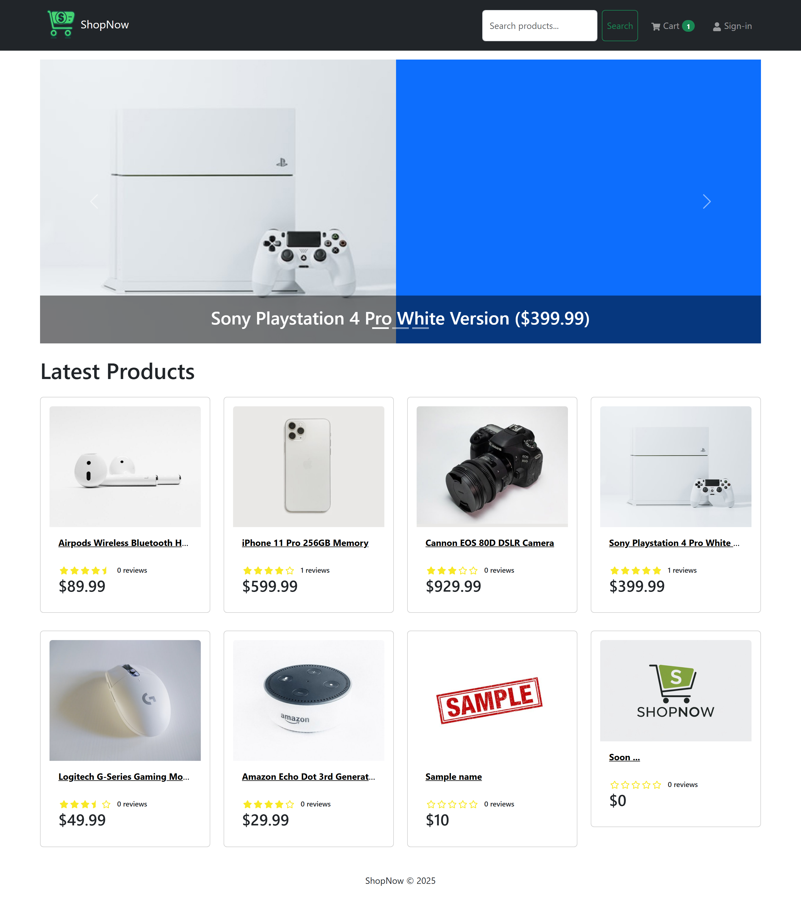
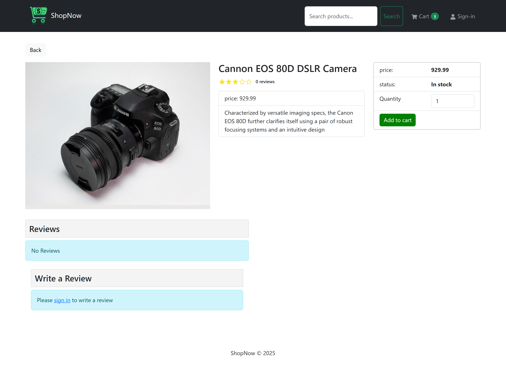
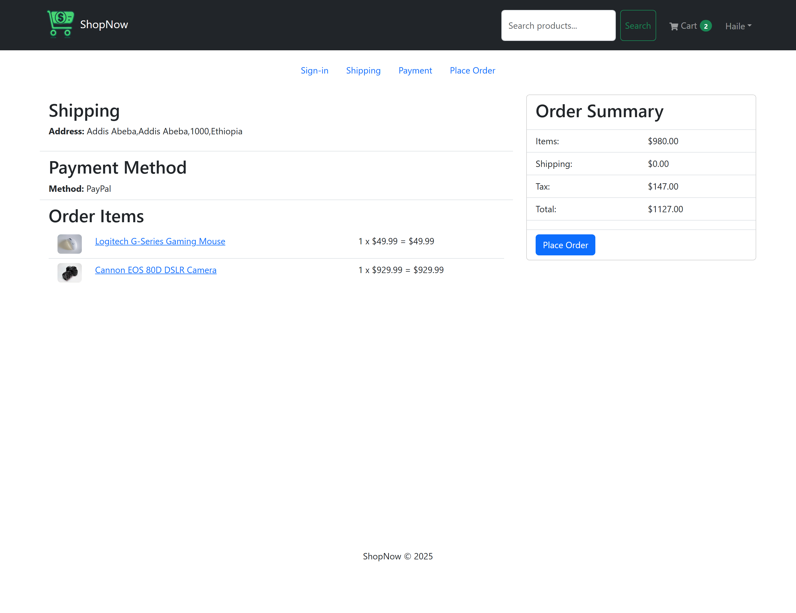
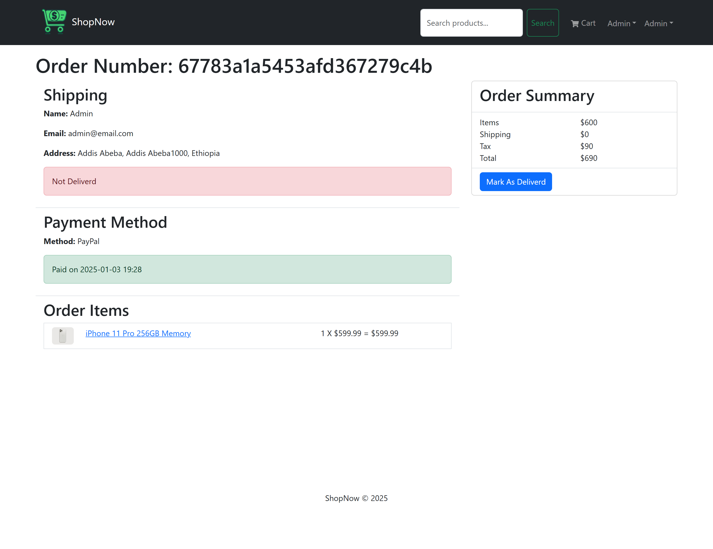
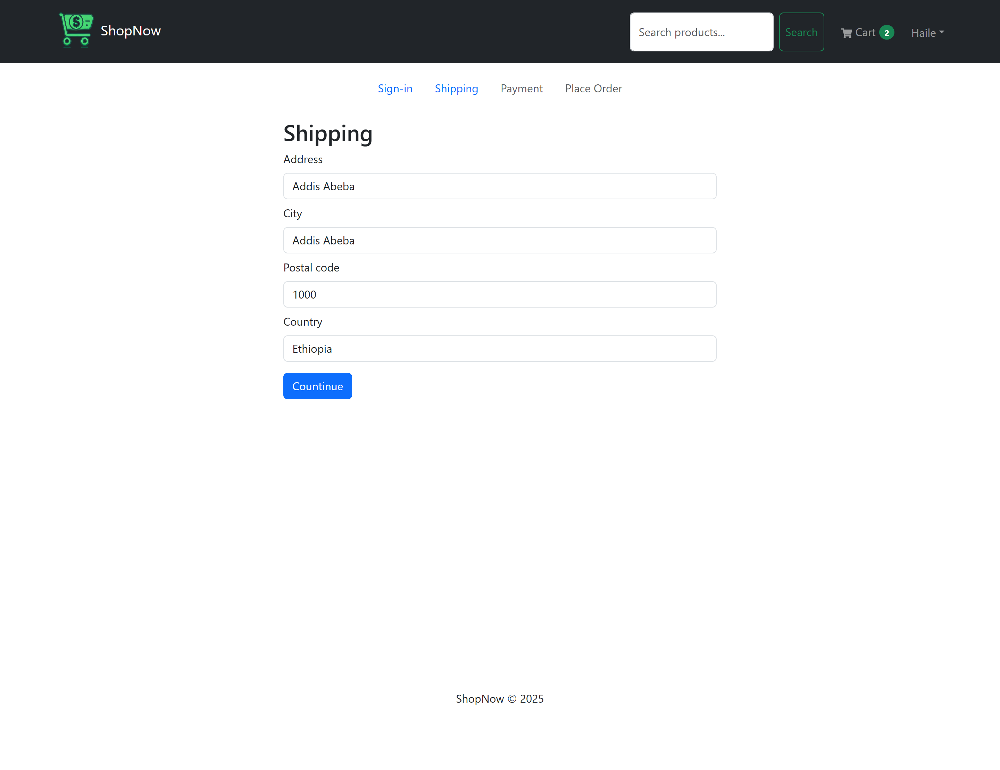
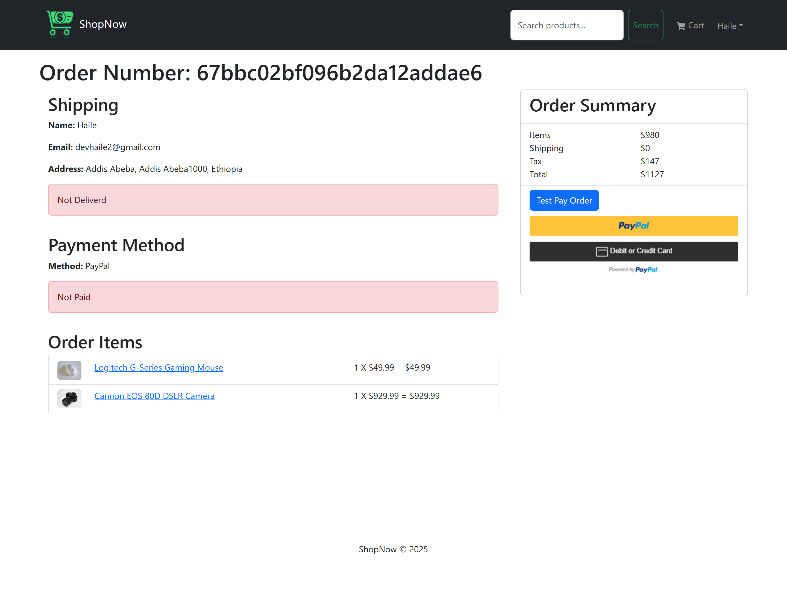
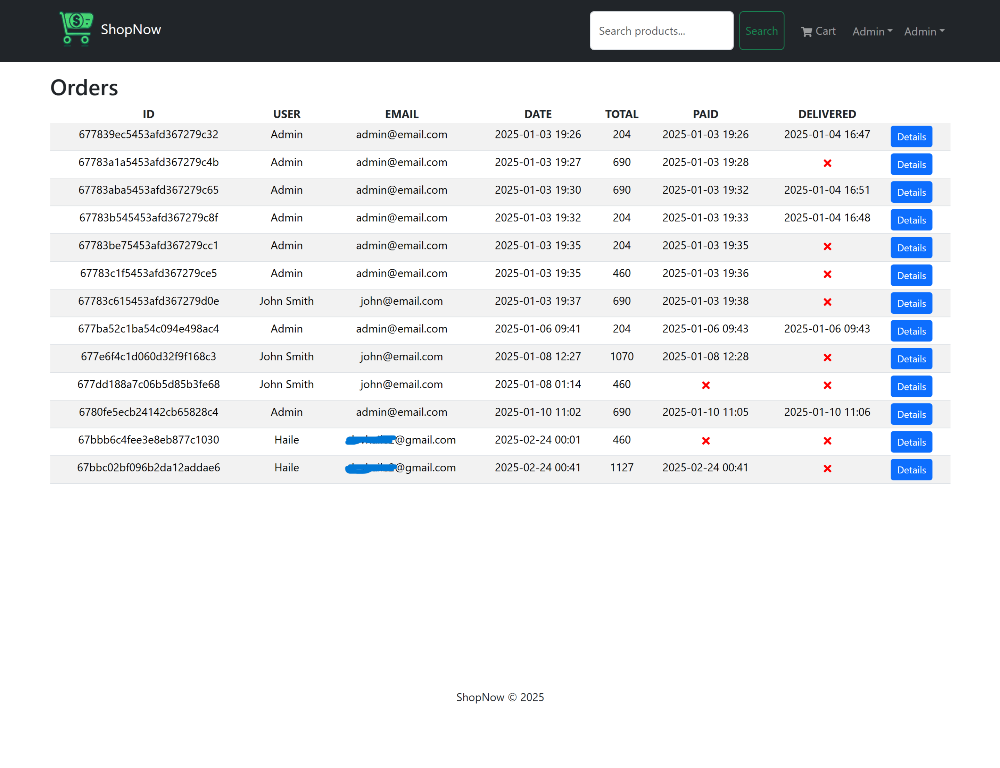
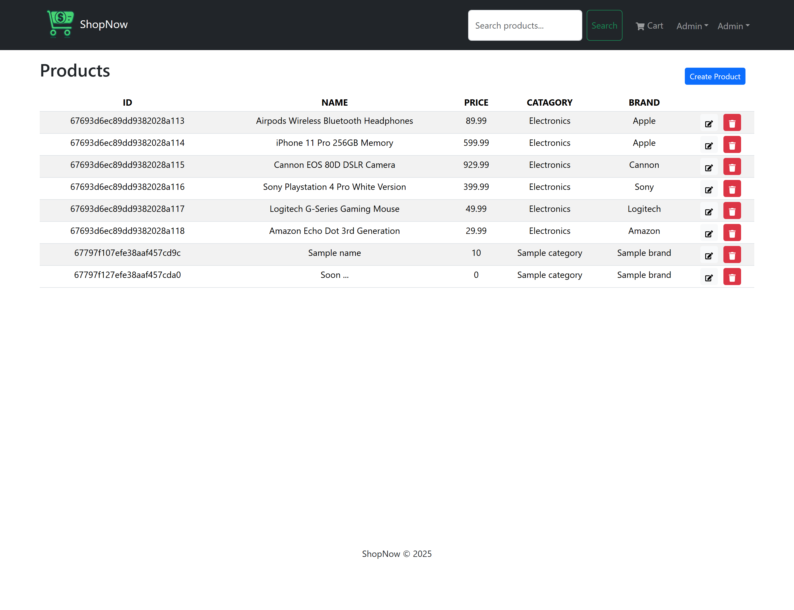
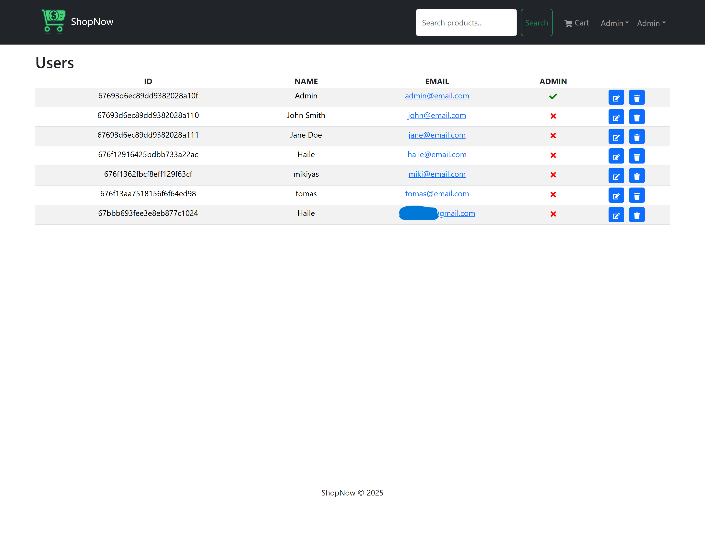

# 🛒ShopNow

An eCommerce web application that allows users to browse, purchase, and review products. Users can manage their carts, make secure online payments via PayPal, and track delivery statuses. Admins can manage products, users, orders, and permissions through an intuitive dashboard.

---

### Home



### Product detail



### Place order



### Admin product control



### Shipping information



### Payment



### Orders



### Products



### Users



---

## 🚀 Features

### 🧑‍💻 User Features

- User registration and login
- Browse and search products
- Add products to cart
- Secure checkout with PayPal integration
- Track order and delivery statuses
- Write and view product reviews
- Manage personal account information

### 🛠️ Admin Features

- Product management (add, edit, delete products)
- Order management (mark orders as delivered, track orders)
- User management (view, edit, and delete users)
- Assign admin permissions to users
- Dashboard overview of sales, orders, and users

---

## 🏗️ Tech Stack

- **Frontend:** React 18 (Vite, Redux Toolkit)
- **Backend:** Node.js, Express.js
- **Database:** MongoDB
- **Authentication:** JWT, bcrypt
- **File Uploads:** Multer
- **Payments:** PayPal REST API
- **Deployment:** _(render)_

---

## 📦 Installation & Setup

### 1. Clone the Repository

```bash
git clone https://github.com/haileyesuschekol/ShopNow.git
```

### 2. Frontend Setup

```bash
cd frontend
npm install
npm run dev
```

### 3. Backend Setup

```bash
cd backend
npm install
npm start
```

### Environment Variables

Create .env files in both frontend and root directories with the following variables:

root (.env)

```bash
PORT=
NODE_ENV=production
MONGO_URI=
JWT_SECRET=
JWT_LIFETIME=
PAYPAL_CLIENT_ID=
PAGINATION_LIMIT=
```

frontend (.env)

```bash

VITE_BASE_URL_DEV=backend-port
BASE_URL_PROD=in-production
```

### Start both frontend and backend

```bash
npm run dev
```
